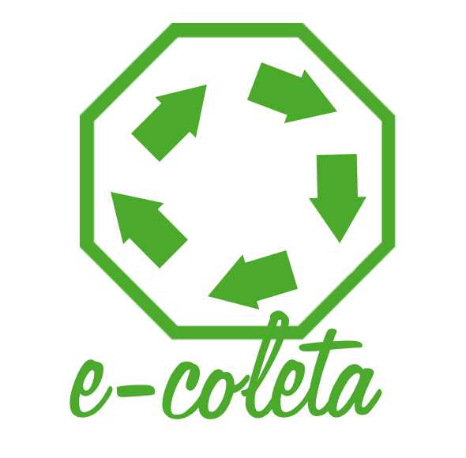

## ♻️ E-coleta

<h1 align="center">
    
</h1>

<h2 align="center">
  ♻️ E-coleta
</h2>

<p align="center">
  

  

  

  
  
  
</p>

<p align="center">
  <a href="#rocket-tecnologias">Tecnologias</a>&nbsp;&nbsp;&nbsp;|&nbsp;&nbsp;&nbsp;
  <a href="#computer-projeto">Projeto</a>&nbsp;&nbsp;&nbsp;|&nbsp;&nbsp;&nbsp;
  <a href="#layout">Layout</a>&nbsp;&nbsp;&nbsp;|&nbsp;&nbsp;&nbsp;
  <a href="#licença">Licença</a>
</p>

---

### 🌎 Projeto

**Um dos maiores problemas atualmente é o lixo que descartamos no nosso Planeta. Sem dúvidas o descarte inadequado com a falta de ações sustentáveis como reciclagem, compostagem e reutilização contribuem para isto. O Brasil carece de medidas que fomentem essas ações. Com isso em mente, o E-coleta é um projeto que visa melhorar a situação de descarte do lixo e de resíduos, entregar uma solução adequada para o descarte dos mesmos. Assim, com a integração de um mapa podemos localizar resíduos, para que os mesmos possam ser recolhidos por empresas e entidades especializadas nisso. Nesse sentido, ele visa auxiliar empresas e entidades que coletam resíduos orgânicos ou inorgânicos que as pessoas precisam descartar em algum momento mas, não sabem onde descartá-lo e, a maneira ecologicamente correta de fazer isso.**

---

### 🔥 Tecnologias

- [NodeJS](https://nodejs.org/en/)
- [ReactJS](https://reactjs.org)
- [React Native](https://facebook.github.io/react-native/)
- [Expo](https://expo.io/)

#### 🚀 Libraries:
  - [Express](https://expressjs.com/pt-br/)
  - [Styled Components](https://www.styled-components.com/)
    
#### ⚙️ Plugins de padronização:
  - [Eslint](https://eslint.org)
  - [Prettier](https://prettier.io)
  - [Husky](https://github.com/typicode/husky)
  - [Lint-staged](https://github.com/okonet/lint-staged)

---

### 🔖 Layout

---

### Como utilizar
Instale o [Git](https://git-scm.com/downloads), o [Visual Studio Code](https://code.visualstudio.com/), o [NodeJS^12.16.1 ou superior](https://nodejs.org/en/) e o [Yarn^1.22.4](https://yarnpkg.com/)
```shell
# Clone este repositório
https://github.com/rwietter/e-coleta.git

# Entre no diretório
cd e-coleta

# Instale as dependências
yarn install

# Inicie a aplicação no back-end
yarn dev

# Inicie a aplicação no front-end
yarn dev

# Inicie a aplicação no mobile
yarn dev
```

---

### 📝 Licença

Esse projeto está sob a licença MIT. Veja o arquivo [LICENSE](LICENSE) para mais detalhes.

---

<bold> Projeto desenvolvido durante a Next Level Week  |  E-coleta </bold> { ♻️ }
